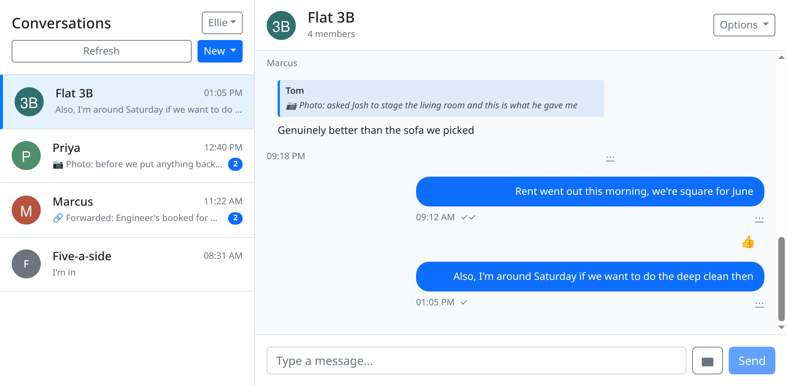

<div align="center">

# WASAText

A messaging web app: direct and group conversations, photos with captions, replies, forwarding, emoji reactions, and WhatsApp-style delivery and read receipts.

Per-recipient group receipts. Go and SQLite, no ORM. Vue 3, no store. An OpenAPI 3 specification kept in step with the code. Builds that never touch the network.

<picture>
  
</picture>

</div>

<br/>

## The problem

A one-to-one chat can keep a single status on the message row. There is exactly one other person, so *sent*, *delivered* and *read* fit in one column and nobody else can contradict it. A group cannot do that. *Delivered* has to mean delivered to everyone, and everyone is a moving target, because people join and leave groups while messages sit in the history.

The question is not what a message's status is. It is whose status counts, and as of when. Get that wrong and the receipt lies in a way the sender will notice:

- With one status column on the message row, five recipients collapse into one value and the last write wins. A message reads *read* because one person out of five opened it.
- Computed against current membership, a message falls back from *read* the moment somebody joins, because the newcomer has not opened something posted before they arrived.
- Computed against current membership again, a message jumps to *read* when the one person who had not opened it leaves the group.

So the recipient set is snapshotted at send time. `SendMessage` writes one `message_recipients` row per participant other than the sender, and one `message_status` row per recipient, in the same transaction as the message itself:

```sql
-- who the message was addressed to, fixed at the moment it was sent
CREATE TABLE message_recipients (
    message_id TEXT NOT NULL,
    user_id    TEXT NOT NULL,
    PRIMARY KEY (message_id, user_id)
);

-- how far each of those recipients has got
CREATE TABLE message_status (
    message_id TEXT NOT NULL,
    user_id    TEXT NOT NULL,
    status     TEXT NOT NULL CHECK (status IN ('sent', 'delivered', 'read')),
    updated_at DATETIME DEFAULT CURRENT_TIMESTAMP,
    PRIMARY KEY (message_id, user_id)
);
```

Whoever joins the group tomorrow is not retroactively expected to read yesterday's message, and whoever leaves does not hold one at *sent* forever. What the sender sees is then counted out of these two tables on every read rather than stored anywhere, which is the other half of the design and is described further down.

## What it does

- **Direct and group conversations** with a live conversation list, ordered by most recent activity, with per-conversation unread counts
- **Text and photo messages**, photos with an optional caption, uploaded as multipart and served back through the API rather than from a public directory
- **Replies** that quote the message being answered
- **Forwarding** to another conversation, or straight to a user, creating the direct conversation if it does not exist yet
- **Emoji reactions**, one per person per message, from a palette of twelve; reacting again replaces your previous reaction rather than stacking
- **Delivery and read receipts**, aggregated across a group so a message reads *delivered* only once every recipient has it and *read* only once every recipient has opened it
- **Profiles and groups**: display name, profile photo, group creation, rename, group photo, add members, leave
- **User search** for starting a new conversation

## Quick start

Go and Docker, nothing else. Node never has to be installed on the host, because `open-node.sh` runs the frontend toolchain inside a throwaway `node:20` container with the repository mounted. The frontend expects the API at `http://localhost:3000`, baked in at build time by `webui/vite.config.js`.

```shell
go run ./cmd/webapi/     # API on :3000, writes ./wasatext.db, photos under ./photos

# in a second terminal
./open-node.sh           # throwaway node:20 container, repository mounted at /src
yarn run dev             # Vite dev server on :5173; leave the container with `exit`
```

See `demo/config.yml` for the settings the server reads, or `development.yml` and `production.yml` for fuller examples. Go dependencies are vendored into `vendor/` and the frontend's are committed as a Yarn [offline mirror](https://yarnpkg.com/features/caching) under `webui/.yarn`. Between them they are most of this repository's size, roughly 35 MB of checked-in dependencies, and in exchange both builds run with the network unplugged.

### Serving the frontend from the Go binary

```shell
./open-node.sh
yarn run build-embed && exit
go build -tags webui ./cmd/webapi/
```

The embedded UI is then served under `/dashboard/`. Without the `webui` build tag the same source compiles to an API-only binary, via a pair of files selected by build constraint (`register-web-ui.go` and `register-web-ui-stub.go`).

### With Docker

```shell
docker build -t wasatext-backend -f Dockerfile.backend .
docker build -t wasatext-frontend -f Dockerfile.frontend .
```

The backend image runs as a non-root user and carries a healthcheck against `/liveness`, which `cmd/healthcheck` also probes for hypervisors that cannot do HTTP probes themselves. The frontend image serves the built assets with nginx.

## The API

`doc/api.yaml` is the OpenAPI 3 description: every endpoint, with schemas, examples and patterns. It is the reference the backend and frontend were both written against, and where the two disagree it is the specification that is right.

<details>
<summary>Every endpoint</summary>

| Endpoint | Purpose |
|---|---|
| `POST /session` | Log in, creating the account if the username is new |
| `/users`, `/users/{id}`, `/users/{id}/photo` | Search, profile, rename, avatar |
| `/conversations`, `/conversations/{id}` | List, start, open, rename |
| `/conversations/{id}/messages` | Send as JSON, or as multipart for photos |
| `/conversations/{id}/messages/{id}` | Delete, update status |
| `/conversations/{id}/forwarded_messages` | Forward |
| `/conversations/{id}/messages/{id}/comments` | React, remove reaction |
| `/groups`, `/groups/{id}`, `/groups/{id}/members` | Group lifecycle |
| `GET /liveness` | Health probe |

</details>

## How it works

### The status the sender sees is derived, not stored

`GetMessageStatus` counts the snapshotted recipients, counts how many have reached *read*, and returns *read* only if those two numbers match. Failing that it counts how many have reached *delivered* or better and returns *delivered* on the same all-or-nothing rule. Otherwise *sent*. Reading the conversation list is what marks messages delivered, and opening a conversation is what marks them read.

The `messages.status` column still exists and is still selected, but for any message the caller sent it is overwritten with the computed aggregate before the row leaves the database layer. There is no cache to invalidate when the fifth recipient finally opens the app, and no way for the stored column and the recipient rows to drift apart.

### Errors carry meaning across the layer boundary

The database package returns sentinel errors, all declared in `service/database/errors.go`: `ErrNotParticipant`, `ErrUsernameTaken`, `ErrNotRecipient` and so on. The API layer matches them with `errors.Is` to pick a status code, so no handler parses an error string to decide between 403 and 500, and rewording a message cannot change an HTTP response.

### Handlers never see the auth header

Routes are registered in `service/api/api-handler.go` through one of two wrappers. `rt.wrap` gives a handler a request-scoped logger and request ID. `rt.wrapAuth` does the same and additionally requires a valid `Authorization: Bearer <user-id>` header, rejects anything else with 401, and hands the authenticated caller down as `ctx.UserID`. Which routes are public is therefore visible in one screenful, and a handler cannot forget to check.

Replies go out through `writeJSON`, which encodes into a buffer before writing anything. Once a status line is on the wire it cannot be taken back, so encoding first means a failure to marshal still becomes a clean 500 rather than a truncated 200.

### Photos

Uploads are validated by sniffing the first 512 bytes rather than trusting the declared `Content-Type`, and the sniffed type is what decides the extension on disk, so a mislabelled body cannot pick its own filename. Files are named by UUID, and the database stores only that name. Because a photo is written to disk before the row that references it exists, every failure path afterwards deletes the file again rather than leaving an orphan behind.

Clients never get a filesystem path. They read photos back through the API, at `/conversations/{id}/messages/{id}/photo`, which resolves the conversation first so that a non-participant cannot reach the file.

### The frontend

Vue 3 with the Options API, Bootstrap 5 for layout, and no store: `ChatView` owns the conversation state and passes it down, while `services/` wraps the API calls and is the only place axios appears. Conversations poll every 3 seconds and the open conversation every 2, each skipping its tick while a load or a send is already in flight.

Photos are fetched as blobs and turned into object URLs, which are explicitly revoked when the conversation changes or the view unmounts, since the browser would otherwise hold on to every image seen during the session.

## Testing

`tests/` holds shell scripts that drive a running server with `curl` and print what each check saw. They report by transcript rather than by exit code, so the output is what you read; they exit zero either way. CI runs `go build` and `go vet`, which is a compile gate.

Start the server first, then:

```shell
bash tests/test_working.sh              # every endpoint, end to end
bash tests/test_message_status.sh       # group delivery and read status
bash tests/test_direct_message_status.sh
bash tests/test_images.sh               # photo upload and validation
```

`test_message_status.sh` is the one worth reading. It drives three users through a group conversation and checks that the status stays *sent* while only one of two recipients has received the message, turns *delivered* when the second does, stays there while only one has read it, and turns *read* only at the end. `test_images.sh` currently fails: a few of its expected status codes are stale and it runs under `set -e`, so it stops at the first photo upload. When a script and `doc/api.yaml` disagree, the specification is the one to trust.

## Scope and known gaps

This was built to a university assignment brief, and some of its shape comes from there.

Authentication is trivial, as the assignment allows: the bearer token *is* the user's ID, there are no passwords, and nothing expires. Every note below follows from taking that seriously.

- **Reactions are not scoped to the conversation.** Adding a reaction checks that you are not the author, but not that you are a participant, so knowing a message ID is enough to react to it.
- **Forwarding checks the destination, not the source.** You must belong to the conversation you forward *into*; you are not checked against the one you forward *out of*. Knowing a message ID is therefore enough to copy its contents somewhere you can read them.
- **SQLite foreign keys are not reliably enforced.** `PRAGMA foreign_keys = ON` is issued once at startup, but it binds to a single pooled connection rather than to the database, so whether a constraint is checked depends on which connection serves the request. The pragma belongs in the DSN.
- **Avatars are public.** `GET /users/{id}/photo` is the one endpoint with no token requirement, so profile photos can be fetched freely. Group photos do require membership.

The first two are a few lines of membership check each, and the third is a connection-string change. They are listed here because they are real, not because they are hard.

## Architecture

```
cmd/webapi/           the API server: config, lifecycle, graceful shutdown, and
                      register-web-ui*.go, selected by the `webui` build tag
cmd/healthcheck/      probes /liveness, for hypervisors without HTTP probes

service/api/          HTTP handlers, one file per resource. api-handler.go holds
                      the whole route table, api-context-wrapper.go the wrap and
                      wrapAuth middleware, photos.go the upload path
service/database/     all SQL, with the AppDatabase interface as the seam.
                      errors.go declares the sentinels, message_methods.go carries
                      send, forward, and the delivery and read status
service/filestore/    photos on disk, content sniffing
service/globaltime/   time.Time wrapper, for testing

webui/src/            views/ (LoginView, ChatView, which owns conversation state),
                      components/, services/ (the only place axios appears), utils/

doc/api.yaml          OpenAPI 3 description of the API
tests/                curl scripts exercising a running server
```

## Built with

Go, SQLite (`mattn/go-sqlite3`), `julienschmidt/httprouter`, `sirupsen/logrus`, `gofrs/uuid`, `ardanlabs/conf`. Vue 3, Vue Router, Vite, axios, Bootstrap 5, Feather icons. Docker for both halves.

## License

MIT, see [LICENSE](LICENSE).

Built for the [Web and Software Architecture](http://gamificationlab.uniroma1.it/en/wasa/) course at Sapienza University of Rome, on top of the course's "Fantastic coffee (decaffeinated)" project template by Enrico Bassetti, whose copyright the licence carries alongside mine.
